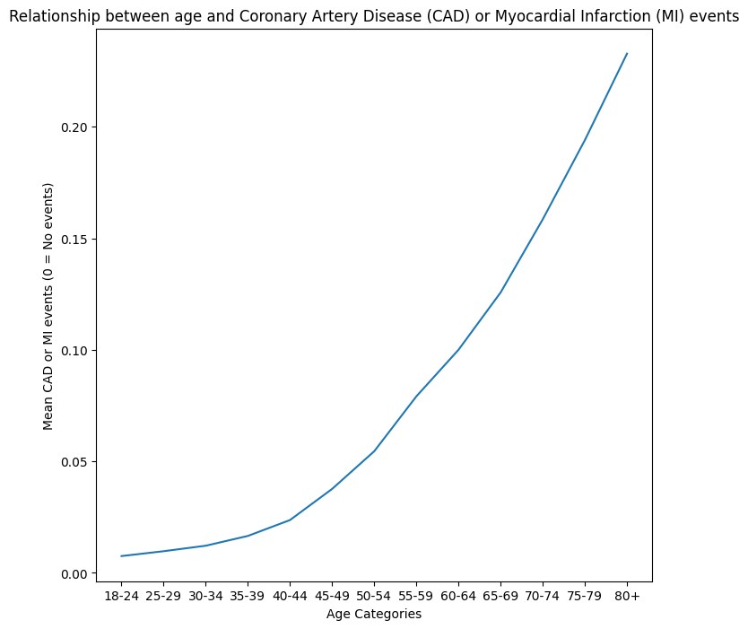
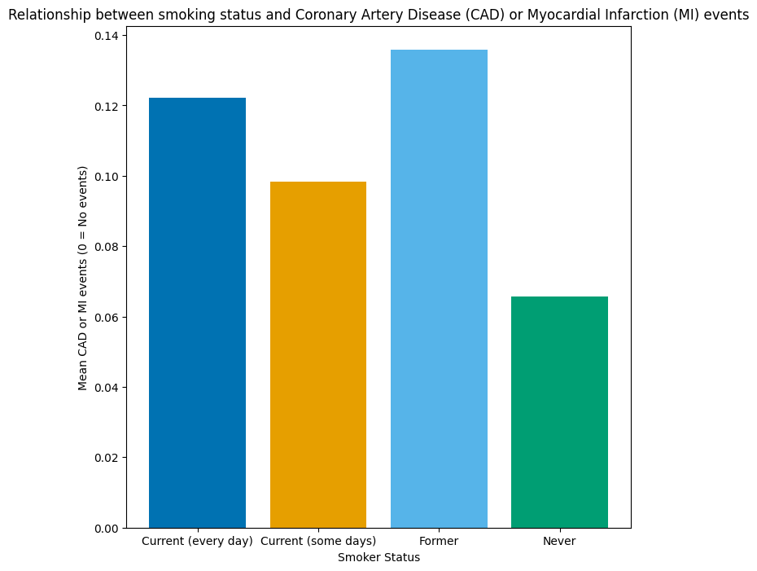
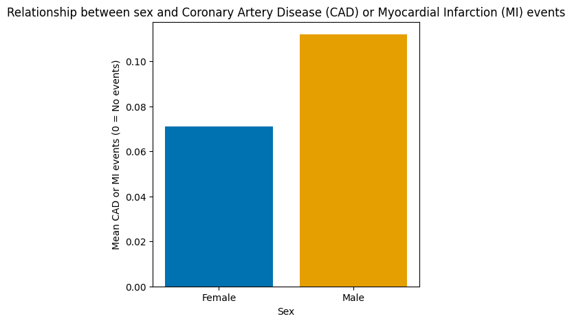
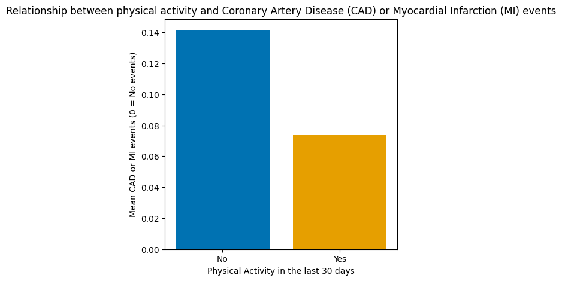
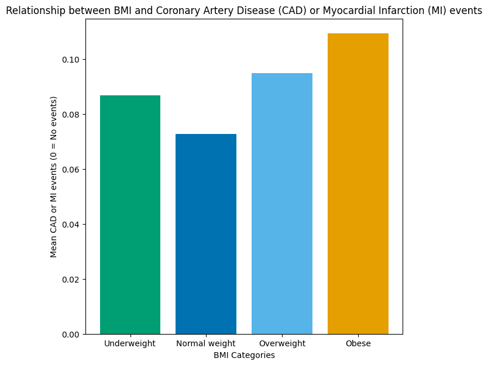
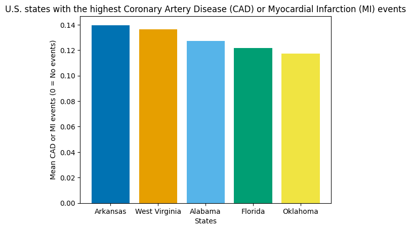

# Cardiovascular Disease Data (2022) 

## Project Overview

This project processes and visualises data from the Centers for Disease Control and Prevention's 2022 Behavioral Risk Factor Surveillance System (BRFSS), a questionnaire conducted across all US states and territories. The survey collected responses from over 445,000 Americans on health-related topics, including health risk behaviours, chronic diseases and conditions, access to health care, and use of preventive health services.

**Project goal:** Transform the raw BRFSS data into a human-readable format and use visualisations to explore the lifestyle factors that drive cardiovascular disease risk — the leading cause of mortality worldwide (Roth et al., 2020).

## Repository Structure

| File | Description |
|---|---|
| `Heart_disease_data.ipynb` | The full analysis: data cleaning, processing, and all six visualisations |
| `heart_converted.parquet` | The 2022 BRFSS response data (445,132 rows × 326 columns), included so the notebook runs standalone |
| `Variable_descriptions.csv` | The 43 SAS variable names used to filter the dataset down to the relevant columns |
| `figures/` | The six visualisations exported directly from the notebook's cell outputs |

## Getting Started

1. Clone the repository:
   ```
   git clone https://github.com/SebManley/cardiovascular_disease_data.git
   ```
2. Install the dependencies:
   ```
   pip install pandas numpy seaborn matplotlib chardet pyarrow
   ```
3. Open `Heart_disease_data.ipynb` in Jupyter and run all cells — it reads `heart_converted.parquet` and `Variable_descriptions.csv` via relative paths, so it runs as-is from the cloned repo.

## Data Cleaning and Processing

* Read the Parquet file of questionnaire responses into a pandas DataFrame.
* Narrowed the dataset from 326 columns to 43 using a CSV file of selected SAS column names, keeping only the columns most relevant to the project goal.
* Replaced the SAS column names with descriptive labels to improve readability.
* Removed rows with missing cardiovascular disease data.
* Mapped encoded numerical values to descriptive values to make the data easier to interpret.

## Data Visualisation

The core aim of this project is to understand the lifestyle factors that influence cardiovascular disease risk in modern-day America. Six figures were produced, each offering a distinct insight. The primary indicator of cardiovascular disease is the calculated variable "Had Coronary Artery Disease or Myocardial Infarction" (CAD/MI), as these are the most prevalent manifestations of cardiovascular disease (Roth et al., 2020).

**Figure 1:** Age vs. cardiovascular disease risk


**Figure 2:** Smoking vs. cardiovascular disease risk


**Figure 3:** Sex vs. cardiovascular disease risk


**Figure 4:** Exercise vs. cardiovascular disease risk


**Figure 5:** BMI vs. cardiovascular disease risk


**Figure 6:** Top five US states by cardiovascular event frequency


## Key Findings

Across the 440,111 respondents with cardiovascular disease data, 9.0% reported having had CAD or MI. Within this sample:

* **Age is the strongest factor.** Reported CAD/MI rises steadily from 0.8% of 18–24 year olds to 23.3% of respondents aged 80+.
* **Smoking is associated with roughly double the rate.** 6.6% of never-smokers reported CAD/MI, compared with 12.2% of daily smokers and 13.6% of former smokers — the former-smoker figure likely reflects both accumulated exposure and quitting after a cardiac event.
* **Men report CAD/MI at a higher rate than women:** 11.2% vs. 7.1%.
* **Physical activity shows a marked difference:** 7.4% among respondents reporting physical activity vs. 14.2% among those reporting none.
* **Risk increases with BMI category:** from 7.3% (normal weight) to 9.5% (overweight) and 10.9% (obese).
* **Rates vary considerably by state.** Arkansas (14.0%), West Virginia (13.6%), Alabama (12.7%), Florida (12.2%), and Oklahoma (11.7%) report the highest frequencies.

These are observational associations from self-reported survey data, not causal estimates — age in particular confounds several of the other relationships.

## Data Source

The parquet file was acquired from https://github.com/kamilpytlak who extracted the raw questionnaire response data directly from https://www.cdc.gov/brfss/annual_data/annual_2022.html

## References

Roth, G.A. et al. (2020) 'Global Burden of Cardiovascular Diseases and Risk Factors, 1990–2019: Update From the GBD 2019 Study', *Journal of the American College of Cardiology*, 76(25), pp. 2982–3021.
